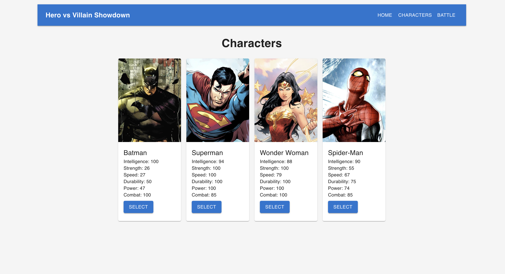
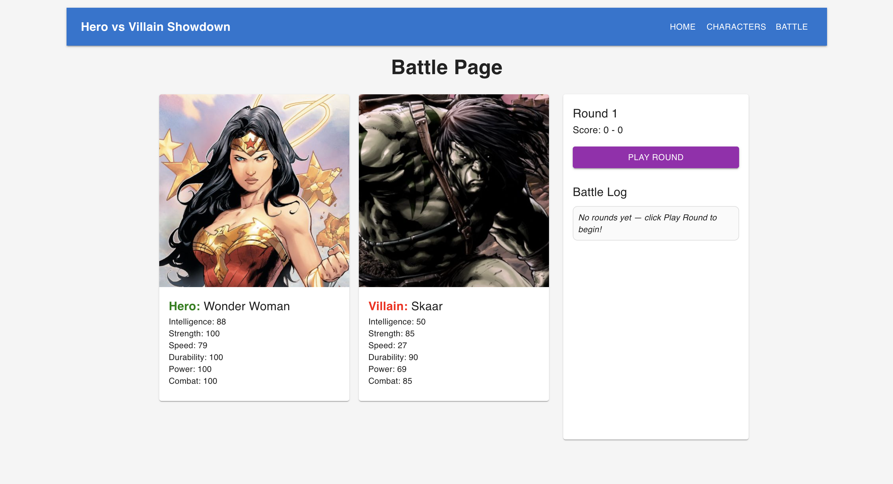
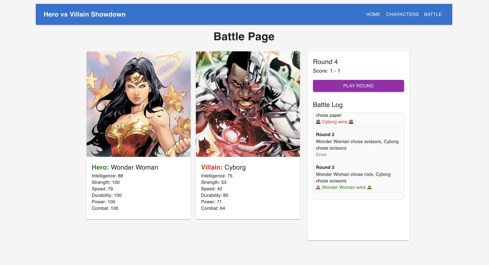
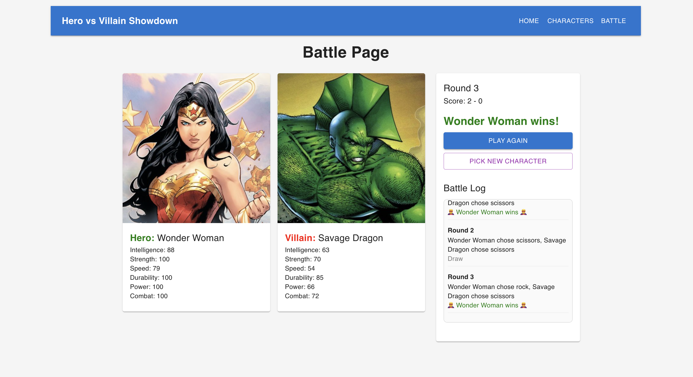

# Hero vs Villain Showdown (React + Express)

> Rock–Paper–Scissors, but with superheroes. Choose a hero, face off against a random villain, and battle in a best-of-3 showdown.

A capstone project implementing a frontend React application with a backend Express proxy. The app integrates with the [SuperHero API](https://superheroapi.com/) to let users browse heroes/villains, view stats, and prepare for battles.

---

## Overview
- **Frontend (React + Vite)**
  - Client-side routing for Home, Characters, and Battle pages
  - Characters page displays a grid of popular heroes with stats
  - Material UI (MUI) for card-based UI
  - Tests with Vitest + React Testing Library

- **Backend (Express)**
  - Proxy route for individual hero lookups (`/api/hero/:id`) → forwards to SuperHero API
  - Endpoint for popular heroes (`/api/popular-heroes`) with live + static fallback
  - Tests with Vitest + Supertest

---

## Features
- Character selection screen with normalized stats
- Live API integration (SuperHero API) with static fallback
- Random opponent selection (excludes chosen hero)
- Battle page with:
  - Hero and villain cards (images + powerstats)
  - Best-of-3 Rock–Paper–Scissors rounds
  - Dynamic battle log with round outcomes
- Server proxy to securely handle API requests
- Robust error handling and fallbacks if API is unavailable

---

## Screenshots

### Characters Page


### Battle Page (before play)


### Battle Page (in progress)


### Battle Page (after win)


---

## Tech Stack
- **Frontend**: React + Vite + React Router + MUI
- **Backend**: Express + CORS + dotenv
- **Testing**: Vitest + React Testing Library + Supertest

---

## Installation & Setup

### 1. Clone & install dependencies
```
git clone git@github.com:your-username/hero-vs-villain-showdown.git
cd hero-vs-villain-showdown

# Install all deps (root, client, server)
npm install
```

### 2. Configure environment variables
```
# client/.env
VITE_API_BASE=http://localhost:5001/api

# server/.env
API_KEY=your_superhero_api_key_here
PORT=5001

```

### 3. Run the app in development
Start the server (Express API proxy):
```
npm run dev --prefix server
# -> http://localhost:5001
```

Start the client (React app):
```
npm run dev --prefix client
# -> http://localhost:5173
```

---

## API Endpoints
### Server (Express)

```
- GET /                   - Health check
- GET /api/popular-heroes - Returns live or static popular heroes
- GET /api/hero/:id       - Fetches single hero data from SuperHero API
```

### Client (React)
```
- /           - Home page
- /characters - Characters list view
- /battle     - Battle page
```

### Manual API Testing
```
# Health check
curl http://localhost:5001/

# Popular heroes (returns list of 4 normalized heroes)
curl http://localhost:5001/api/popular-heroes | jq

# Single hero (Batman, id=70)
curl http://localhost:5001/api/hero/70 | jq
```

## Running Tests
```
# Run all tests (client + server)
npm test
```

Tests include:
```
- Characters page renders hero cards with normalized powerstats
- Battle page supports best-of-3 rounds and logs outcomes
- Battle log appends multiple rounds correctly
- Server proxy responds to health checks
- Server proxy fetches hero data via mocked API calls
```

---

## Project Structure
```
hero-vs-villain-showdown/
├── client
│   ├── eslint.config.js
│   ├── index.html
│   ├── public
│   │   └── vite.svg
        └── screenshots/        # Project screenshots for README
│   ├── src
│   │   ├── __tests__           # Client-side tests
│   │   ├── App.css
│   │   ├── App.jsx
│   │   ├── assets
│   │   ├── index.css
│   │   ├── main.jsx
│   │   ├── pages               # Pages: Characters, Battle, Home
│   │   └── utils               # Utilities (e.g., rpsLogic)
│   └── vite.config.js
├── LICENSE
├── package-lock.json
├── package.json
├── README.md
├── server
│   ├── __tests__               # Server-side tests
│   │   ├── popularHeroes.test.js
│   │   └── proxy.test.js
│   ├── api
│   │   └── popularHeroes.js    # Static fallback data
│   └── index.js                # Express server + API proxy
├── vitest.config.js
└── vitest.setup.js
```

---

## Future Improvements
- Deploy client (Vercel) + server (Render/Heroku/Railway)
- Expand Characters page with searchable/filterable hero list
- Add animations and transitions during battles
- Improve opponent selection (e.g., balanced difficulty)
- Persist battle history, implement player and character leaderboards

---

## About This Repo
**Author:** Nick Rathbone | [GitHub Profile](https://github.com/nrathbone-turing)

This project is part of the Flatiron School Capstone course.

**Notes**
- Uses live Superhero API but falls back to static heroes if API_KEY is missing.
- Normalized powerstats + images so UI always renders consistently.
- Currently local dev only (deployment planned in future).

**License:** MIT — feel free to use or remix!